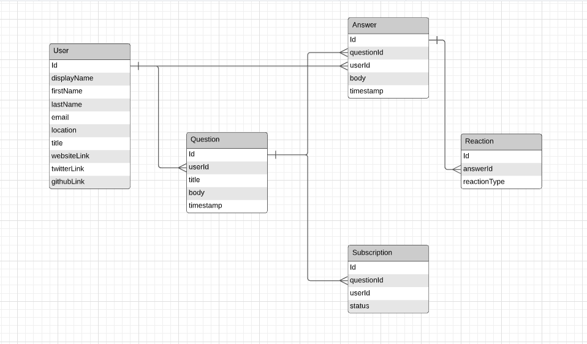

# victor-abidoye

StackOverflow-Clone
It is a question and answer site for professional and enthusiast programmers. 

* testing using jest
* Node js web application used is Express

## Useful commands

Install dependencies

    npm install

Run unit tests

    npm test

Build everything (outputs will live in `dist/`-directory)

    npm run build

Start development server with hot reloading (open `http://localhost:8080/`)

    npm start

## Database Design

## Improvement
Below are the important improvements to consider
* Implement a message broker using a pub sub approach for the subscription notification feature. This will be higly considered for scalability and reliability reasons